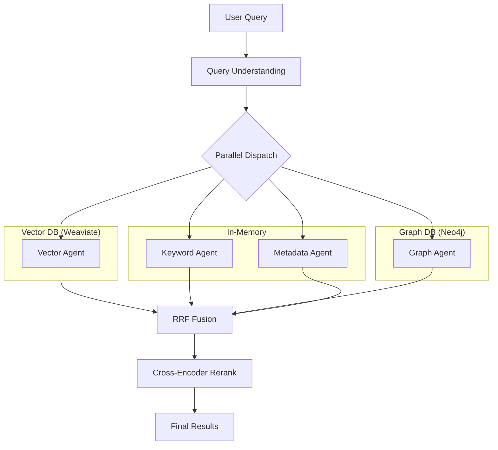

# Enhanced RAG System v5.0 - Deep Technical Documentation

## Enterprise-Grade Retrieval-Augmented Generation with RRF Fusion

**Version**: 5.0.0 | **Date**: January 2025 | **Author**: AI Agent Platform

---

# 1. System Overview

## What Problem This RAG System is Solving

This RAG system solves the **incident remediation script matching problem**: given an incident description like "VM instance test-vm-01 is down and not responding", the system must find the most appropriate remediation script from a registry of 20+ scripts.

**The Challenge:**
- Incident descriptions are noisy, unstructured natural language
- Multiple scripts might partially match (restart VM, reboot VM, start VM)
- Historical context matters (which scripts worked before?)
- False positives are costly (wrong script could make things worse)

**Why This Matters:**
- Mean Time To Resolution (MTTR) directly impacts SLA compliance
- Manual script selection takes 5-15 minutes per incident
- Wrong script selection causes cascading failures

## Why Simple Vector RAG is Insufficient

A naive vector-only approach has critical limitations:

```
Simple Vector RAG:
Query: "VM is down" → Embed → Find similar vectors → Return top result

PROBLEM: "VM is down" embeds similarly to:
- "VM is up" (semantically close!)
- "VM shutdown scheduled" (contains same keywords)
- "VPN is down" (phonetically similar)
```

**Specific Failures of Vector-Only:**

| Scenario | Vector Search Result | Correct Result |
|----------|---------------------|----------------|
| "Disk 95% full" | "Disk utility guide" (similar words) | "Clear disk space script" |
| "Pod CrashLoopBackOff" | "Crash course tutorial" | "Restart Kubernetes pod" |
| "Database slow" | Generic DB docs | Script that fixed this before |

## Why Graph + Vector Hybrid is Used

The hybrid approach combines multiple signals:

```
HYBRID SIGNALS:

1. SEMANTIC (Vector)     → "What does this mean?"
   Captures: Meaning, intent, similar concepts

2. LEXICAL (Keyword)     → "What words match exactly?"
   Captures: Technical terms, error codes, exact names

3. STRUCTURAL (Graph)    → "What worked before?"
   Captures: Historical success, service relationships

4. EXPLICIT (Metadata)   → "What constraints exist?"
   Captures: Cloud provider, environment, severity
```

**Real Example:**

```
Incident: "GCP VM instance prod-api-01 in us-central1-a is unresponsive"

Vector Agent:  "Start GCP instance" (semantic match: "unresponsive" ≈ "start")
Keyword Agent: "GCP VM instance restart" (exact term matches)
Graph Agent:   "This script fixed 15 similar incidents" (historical success)
Metadata Agent: "GCP, production, compute engine" (field matches)

Combined: High confidence → "Restart GCP VM Instance" script
```

---

# 2. High-Level Architecture

## Components

```
┌─────────────────────────────────────────────────────────────────────────────┐
│                      RAG SYSTEM v5.0 ARCHITECTURE                           │
├─────────────────────────────────────────────────────────────────────────────┤
│                                                                             │
│  ┌─────────────────┐                                                        │
│  │  USER QUERY     │  "VM instance test-vm-01 is down"                      │
│  └────────┬────────┘                                                        │
│           │                                                                 │
│           ▼                                                                 │
│  ┌─────────────────────────────────────────────┐                           │
│  │         QUERY UNDERSTANDING                  │                           │
│  │  • Intent: RESTART                          │                           │
│  │  • Entities: {instance: "test-vm-01"}       │                           │
│  │  • Service: GCP                             │                           │
│  │  • Expanded: "down stopped offline restart" │                           │
│  └────────┬────────────────────────────────────┘                           │
│           │                                                                 │
│           ▼                                                                 │
│  ┌─────────────────────────────────────────────────────────────────┐       │
│  │                 4 PARALLEL SEARCH AGENTS                         │       │
│  │  ┌──────────┐ ┌──────────┐ ┌──────────┐ ┌──────────┐            │       │
│  │  │  VECTOR  │ │ KEYWORD  │ │  GRAPH   │ │ METADATA │            │       │
│  │  │  AGENT   │ │  AGENT   │ │  AGENT   │ │  AGENT   │            │       │
│  │  │          │ │          │ │          │ │          │            │       │
│  │  │ Weaviate │ │ TF-IDF   │ │  Neo4j   │ │ Exact    │            │       │
│  │  │ Cosine   │ │ BM25     │ │ FIXED_BY │ │ Match    │            │       │
│  │  └────┬─────┘ └────┬─────┘ └────┬─────┘ └────┬─────┘            │       │
│  │       │Rank 1      │Rank 3      │Rank 2      │Rank 4            │       │
│  └───────┼────────────┼────────────┼────────────┼──────────────────┘       │
│          │            │            │            │                          │
│          └────────────┴─────┬──────┴────────────┘                          │
│                             ▼                                              │
│  ┌─────────────────────────────────────────────┐                           │
│  │           RRF FUSION (Rank Aggregation)     │                           │
│  │                                              │                           │
│  │   Score = Σ (1 / (60 + rank_i))             │                           │
│  │                                              │                           │
│  │   No weights! Just rankings.                │                           │
│  └────────┬────────────────────────────────────┘                           │
│           │                                                                 │
│           ▼ Top 20 Candidates                                              │
│  ┌─────────────────────────────────────────────┐                           │
│  │      CROSS-ENCODER RERANKING                │                           │
│  │                                              │                           │
│  │   Model: ms-marco-MiniLM-L-6-v2             │                           │
│  │   Input: (Query, Document) pairs            │                           │
│  │   Output: Joint relevance scores            │                           │
│  └────────┬────────────────────────────────────┘                           │
│           │                                                                 │
│           ▼ Top 5 Final Results                                            │
│  ┌─────────────────────────────────────────────┐                           │
│  │           FINAL RESULTS                      │                           │
│  │                                              │                           │
│  │   1. restart_gcp_instance.sh (0.94)         │                           │
│  │   2. start_gcp_vm.yml (0.87)                │                           │
│  │   3. scale_gcp_instance.tf (0.72)           │                           │
│  └─────────────────────────────────────────────┘                           │
│                                                                             │
└─────────────────────────────────────────────────────────────────────────────┘
```

## Component Interactions



## Data Stores

| Store | Technology | Purpose | Data |
|-------|------------|---------|------|
| Vector DB | Weaviate | Semantic search | 384-dim embeddings |
| Graph DB | Neo4j | Relationship queries | Scripts, Incidents, Services |
| Cache | Redis | Embedding cache | MD5 → vector mappings |
| Registry | JSON files | Script metadata | Keywords, patterns, paths |

---

# 3. Data Ingestion Pipeline

## What Data is Ingested

**Script Registry Files:**
```
/home/samrattidke600/ai_agent_app/registry.json
/home/samrattidke600/ai_agent_app/backend/data/registry.json
/home/samrattidke600/ai_agent_app/backend/runbooks/registry.json
```

**Script Metadata Structure:**
```json
{
  "id": "ansible-restart-nginx",
  "name": "Restart Nginx Web Server",
  "path": "ansible/restart_nginx.yml",
  "type": "ansible",
  "service": "web",
  "action": "restart",
  "risk_level": "low",
  "requires_approval": false,
  "keywords": ["nginx", "web", "server", "502", "504", "gateway", "timeout"],
  "error_patterns": ["502.*bad.*gateway", "504.*gateway.*timeout", "nginx.*not.*running"],
  "tags": ["nginx", "web", "restart", "service"]
}
```

## How Data is Chunked

For remediation scripts, chunking is minimal because:
- Scripts are already atomic units
- Each script = one document
- No sentence/paragraph splitting needed

**Searchable Text Construction:**
```python
search_text = f"""
{script.get('name', '')}
{script.get('description', '')}
Keywords: {' '.join(script.get('keywords', []))}
Error patterns: {' '.join(script.get('error_patterns', []))}
Service: {script.get('service', '')}
Action: {script.get('action', '')}
Tags: {' '.join(script.get('tags', []))}
"""
```

This creates a dense, searchable document combining all relevant fields.

## How Embeddings are Created

**Embedding Model:** `all-MiniLM-L6-v2` (SentenceTransformer)
- Dimension: 384
- Speed: ~500 docs/sec
- Quality: Optimized for semantic similarity
- Cost: Free (local)

**Process:**
```python
from sentence_transformers import SentenceTransformer

model = SentenceTransformer('all-MiniLM-L6-v2')

# Batch processing for efficiency
texts = [script['searchable_text'] for script in scripts]
embeddings = model.encode(
    texts,
    batch_size=32,
    normalize_embeddings=True  # L2 normalization for cosine similarity
)
```

**Normalization:** L2 normalization applied so dot product = cosine similarity.

## What Metadata is Attached

Each Weaviate object includes:

```json
{
  "script_id": "ansible-restart-nginx",
  "name": "Restart Nginx Web Server",
  "description": "Full searchable text...",
  "path": "ansible/restart_nginx.yml",
  "script_type": "ansible",
  "service": "web",
  "action": "restart",
  "keywords": ["nginx", "web", "server"],
  "error_patterns": ["502.*bad.*gateway"],
  "risk_level": "low",
  "requires_approval": false,
  "tags": ["nginx", "web", "restart"]
}
```

## How Neo4j Nodes/Edges are Populated

**Node Types:**

```cypher
// Script node
(:Script {
  id: "ansible-restart-nginx",
  name: "Restart Nginx Web Server",
  path: "ansible/restart_nginx.yml",
  type: "ansible",
  service: "web",
  risk_level: "low",
  keywords: ["nginx", "web"],
  created_at: "2025-01-02T..."
})

// Incident node (historical)
(:Incident {
  incident_id: "INC-A1B2C3",
  title: "Nginx 502 error",
  description: "Web server returning 502",
  service: "web",
  severity: "2",
  created_at: "2025-01-01T...",
  resolved_at: "2025-01-01T..."
})

// Service node
(:Service {
  name: "web",
  tier: "application"
})
```

**Relationship Types:**

```cypher
// FIXED_BY - Script resolved an incident
(incident:Incident)-[:FIXED_BY {
  success: true,
  resolution_time: 5.3,  // minutes
  executed_at: "2025-01-01T...",
  verified: true
}]->(script:Script)

// TARGETS - Script operates on a service
(script:Script)-[:TARGETS]->(service:Service)

// AFFECTS - Incident impacted a service
(incident:Incident)-[:AFFECTS]->(service:Service)

// DEPENDS_ON - Service dependency graph
(service1:Service)-[:DEPENDS_ON]->(service2:Service)

// Example: nginx DEPENDS_ON kubernetes
```

**Population Script Logic:**
```python
# Generate historical incidents with FIXED_BY relationships
for script in scripts:
    # Create 3-8 synthetic historical incidents per script
    for i in range(random.randint(3, 8)):
        incident = generate_historical_incident(script)

        # Create FIXED_BY relationship
        session.run("""
            MERGE (i:Incident {incident_id: $incident_id})
            SET i.title = $title, ...

            WITH i
            MATCH (s:Script {id: $script_id})
            MERGE (i)-[r:FIXED_BY]->(s)
            SET r.success = $success,
                r.resolution_time = $resolution_time,
                r.executed_at = $executed_at
        """, params)
```

---

# 4. Vector Retrieval Explained

## Embedding Model Used

**Model:** `all-MiniLM-L6-v2`
- **Architecture:** BERT-based transformer
- **Dimension:** 384 (compact, fast)
- **Training:** Trained on 1B+ sentence pairs
- **Specialty:** Semantic textual similarity

**Why This Model:**
- Fast inference (CPU-friendly)
- Good quality for short texts
- No API costs
- Works offline

**Alternative (fallback):** OpenAI `text-embedding-3-small` (1536 dim)

## Similarity Search Logic

**Storage:** Weaviate vector database with HNSW index

**Search Flow:**
```python
# 1. Embed the query
query_embedding = embedding_service.embed(query)  # [384 floats]

# 2. Query Weaviate for nearest neighbors
results = script_collection.query.near_vector(
    near_vector=query_embedding.tolist(),
    limit=20,
    return_metadata=MetadataQuery(distance=True)
)

# 3. Distance to similarity conversion
# Weaviate returns cosine distance (0 = identical, 2 = opposite)
similarity = 1 - (distance / 2)
```

**HNSW Index Parameters:**
```yaml
ef: 128         # Search depth (accuracy vs speed)
efConstruction: 128  # Build-time depth
maxConnections: 64   # Graph density
```

## Score Meaning and Limitations

**Score Range:** 0.0 to 1.0 (cosine similarity)

| Score | Interpretation |
|-------|----------------|
| 0.90+ | Near-exact semantic match |
| 0.70-0.90 | Strong semantic similarity |
| 0.50-0.70 | Moderate similarity |
| 0.30-0.50 | Weak similarity |
| <0.30 | Probably unrelated |

**Threshold:** 0.1 minimum (filter noise)

## What Vector Retrieval is Good At

1. **Synonym Handling**
   - "VM is down" matches "instance stopped"
   - "OOM killed" matches "out of memory"

2. **Intent Matching**
   - "Need to scale" matches "increase capacity"
   - "Clean up" matches "remove temporary files"

3. **Paraphrase Detection**
   - "Database slow" matches "DB performance degraded"

4. **Cross-Language (if multilingual model)**
   - "Der Server ist ausgefallen" matches "Server down"

## What Vector Retrieval is Bad At

1. **Negation**
   - "VM is NOT running" embeds similarly to "VM is running"
   - Vectors capture words, not logical operators

2. **Numerical Precision**
   - "Disk 95% full" vs "Disk 50% full" are similar vectors
   - Numbers lose meaning in embedding space

3. **Entity Confusion**
   - "test-vm-01 down" may match docs about "prod-vm-01"
   - Specific identifiers need exact matching

4. **Antonyms**
   - "Start instance" and "Stop instance" are semantically close!
   - Action verbs cluster together

**Solution:** Combine with keyword matching (handles negation, numbers, entities).

---

# 5. Neo4j / Graph Retrieval Explained

## Node Types

```
┌─────────────────────────────────────────────────────────────────────┐
│                         NEO4J GRAPH SCHEMA                          │
├─────────────────────────────────────────────────────────────────────┤
│                                                                     │
│    ┌──────────┐          FIXED_BY           ┌──────────┐           │
│    │ Incident │ ─────────────────────────→ │  Script  │           │
│    │          │  {success, time, verified} │          │           │
│    └────┬─────┘                             └────┬─────┘           │
│         │                                        │                  │
│         │ AFFECTS                      TARGETS   │                  │
│         ▼                                        ▼                  │
│    ┌──────────┐         DEPENDS_ON         ┌──────────┐           │
│    │ Service  │ ───────────────────────→  │ Service  │           │
│    │  (web)   │                            │  (k8s)   │           │
│    └──────────┘                            └──────────┘           │
│                                                                     │
└─────────────────────────────────────────────────────────────────────┘
```

**Script Node:**
- `id`: Unique identifier (e.g., "ansible-restart-nginx")
- `name`: Human-readable name
- `path`: File path to script
- `type`: ansible, shell, terraform, kubernetes
- `service`: Target service category
- `risk_level`: low, medium, high, critical
- `keywords`: Array of search terms
- `error_patterns`: Regex patterns this script handles

**Incident Node:**
- `incident_id`: ServiceNow incident ID
- `title`: Short description
- `description`: Full incident description
- `service`: Affected service
- `severity`: 1 (critical) to 4 (low)
- `created_at`: When incident occurred
- `resolved_at`: When resolved (if applicable)

**Service Node:**
- `name`: Service identifier (e.g., "kubernetes", "database")
- `tier`: infrastructure, platform, application, data

## Relationship Types

**FIXED_BY** (Most Important for Scoring)
```cypher
(incident:Incident)-[:FIXED_BY {
  success: boolean,       // Did this fix work?
  resolution_time: float, // Minutes to resolve
  executed_at: datetime,  // When executed
  verified: boolean       // Human-verified success?
}]->(script:Script)
```

**AFFECTS** (Incident → Service)
```cypher
(incident:Incident)-[:AFFECTS]->(service:Service)
// Links incidents to affected services
```

**TARGETS** (Script → Service)
```cypher
(script:Script)-[:TARGETS]->(service:Service)
// Links scripts to services they operate on
```

**DEPENDS_ON** (Service → Service)
```cypher
(service1:Service)-[:DEPENDS_ON]->(service2:Service)
// Service dependency graph
// Example: api-gateway DEPENDS_ON nginx DEPENDS_ON kubernetes
```

## Traversal Logic

**Primary Query: Historical Success Scoring**

```cypher
MATCH (i:Incident)-[r:FIXED_BY {success: true}]->(s:Script {id: $script_id})
WHERE (i)-[:AFFECTS]->(:Service {name: $service})
RETURN
  s.id as script_id,
  count(r) as execution_count,
  avg(r.resolution_time) as avg_resolution_time,
  sum(CASE WHEN r.success THEN 1 ELSE 0 END) * 1.0 / count(r) as success_rate,
  max(r.executed_at) as last_used
ORDER BY execution_count DESC
LIMIT 10
```

**Scoring Formula:**
```python
Graph_Score = (
    0.40 * fixed_count_normalized +    # How often it worked
    0.30 * success_rate +               # Success percentage
    0.20 * speed_score +                # Resolution speed
    0.10 * recency_score                # Recent usage bonus
)

# Normalization functions:
fixed_count_normalized = min(fixed_count / 20, 1.0)
speed_score = max(0, 1.0 - (avg_minutes / 60))
recency_score = max(0, 1.0 - (days_since_last_use / 30))
```

## Why Graph Retrieval is Needed

**Vector retrieval fails when:**
- Two scripts are semantically similar but have different success histories
- A script worked for GCP but failed for AWS
- Historical context matters more than description

**Graph answers:**
- "Which script has the best track record for this service?"
- "How fast does this script typically resolve issues?"
- "Has this ever failed? How often?"

## Examples of Queries Graph Answers Better

### Example 1: Best Script for Service

**Question:** "Which restart script works best for Nginx?"

```cypher
MATCH (i:Incident)-[r:FIXED_BY {success: true}]->(s:Script)
WHERE s.name CONTAINS 'restart' AND (i)-[:AFFECTS]->(:Service {name: 'web'})
RETURN s.name, count(r) as successes, avg(r.resolution_time) as avg_time
ORDER BY successes DESC, avg_time ASC
LIMIT 5
```

**Vector would fail:** All restart scripts embed similarly.

### Example 2: Service Blast Radius

**Question:** "What other services might be affected if I restart Kubernetes?"

```cypher
MATCH (s:Service {name: 'kubernetes'})<-[:DEPENDS_ON*1..3]-(dependent:Service)
RETURN dependent.name, length(path) as depth
ORDER BY depth ASC
```

**Result:** api-gateway, payment-service, auth-service (all depend on k8s)

### Example 3: Script Success Rate by Environment

**Question:** "Does this script work better in prod or staging?"

```cypher
MATCH (i:Incident)-[r:FIXED_BY]->(s:Script {id: $script_id})
WHERE i.environment IS NOT NULL
RETURN
  i.environment,
  count(CASE WHEN r.success THEN 1 END) as successes,
  count(CASE WHEN NOT r.success THEN 1 END) as failures
```

---

# 6. Hybrid Retrieval Strategy

## How Vector and Graph Results are Combined

**The Problem:** Each agent returns different score scales.

| Agent | Score Range | Meaning |
|-------|-------------|---------|
| Vector | 0.0 - 1.0 | Cosine similarity |
| Keyword | 0.0 - 1.0 | TF-IDF similarity |
| Graph | 0.0 - 1.0 | Historical success composite |
| Metadata | 0.0 - 1.0 | Field match percentage |

**Why Not Simple Averaging?**
- A 0.8 from Vector doesn't mean the same as 0.8 from Graph
- Scales are semantically different
- Some agents might always return higher scores

**Solution: Rank-Based Fusion (RRF)**

Convert scores to ranks, then fuse:
```python
# Instead of: final = 0.4*vector + 0.3*keyword + ...
# Use: final = RRF(vector_rank, keyword_rank, graph_rank, metadata_rank)
```

## Retrieval Signals

### 1. Semantic Signal (Vector Agent)
**What:** Meaning-based similarity
**How:** Cosine similarity of embeddings
**Strength:** Handles synonyms, paraphrases
**Weakness:** Ignores exact matches, negation

### 2. Lexical Signal (Keyword Agent)
**What:** Word-level matching
**How:** TF-IDF + BM25 scoring
**Strength:** Exact terms, error codes, identifiers
**Weakness:** No understanding of meaning

### 3. Structural Signal (Graph Agent)
**What:** Historical relationships
**How:** Neo4j traversal of FIXED_BY edges
**Strength:** "What worked before?"
**Weakness:** Cold start for new scripts

### 4. Explicit Signal (Metadata Agent)
**What:** Structured field matching
**How:** Exact/partial field comparison
**Strength:** Hard constraints (cloud, env)
**Weakness:** Limited to known fields

## Why Multiple Retrievers are Used

**Single-retriever failures:**

| Query | Vector Finds | Keyword Finds | Graph Finds | Correct |
|-------|--------------|---------------|-------------|---------|
| "Pod crash" | Generic restart | "pod crash" in name | Most successful k8s script | k8s restart |
| "Error 502" | Web error docs | Exact "502" match | Nginx restart (worked 10x) | Nginx restart |
| "VM slow" | VM scale up | Nothing (no exact term) | DB optimization (fixed similar) | DB script |

**Multi-retriever success:**
- Each retriever catches what others miss
- RRF fusion rewards scripts that rank high across multiple retrievers
- No single point of failure

---

# 7. Reciprocal Rank Fusion (RRF)

## What RRF Is (Simple Explanation)

RRF converts **ranking positions** into scores, then sums them.

**Core Idea:** "A script that ranks #1 in multiple agents is better than one that ranks #1 in only one."

**Formula:**
```
RRF_Score(doc) = Σ (1 / (k + rank_i))

Where:
- k = 60 (constant, dampens extreme ranks)
- rank_i = position from agent i (1 = best)
- Sum over all agents that found this doc
```

## Why RRF is Used Instead of Score Averaging

### Problem with Score Averaging

```python
# Weighted average approach
final = 0.40 * vector_score + 0.25 * keyword_score + 0.25 * graph_score + 0.10 * metadata_score
```

**Issues:**
1. **Scale mismatch:** Vector 0.9 ≠ Graph 0.9
2. **Weight tuning:** Why 0.40? Requires experimentation.
3. **Brittleness:** New agent = retune all weights
4. **Score inflation:** Some agents always score high

### RRF Solution

```python
# RRF approach
final = 1/(60+1) + 1/(60+3) + 1/(60+2) + 1/(60+5)
#       vector      keyword    graph     metadata
#       rank=1      rank=3     rank=2    rank=5
```

**Benefits:**
1. **Scale-invariant:** Only positions matter
2. **No weight tuning:** k=60 is proven constant
3. **Extensible:** Add agents without recalibration
4. **Stable:** Rank distributions are more consistent

## Step-by-Step RRF Example

**Scenario:** Query "GCP VM down", 3 candidate scripts

**Agent Rankings:**

| Script | Vector Rank | Keyword Rank | Graph Rank | Metadata Rank |
|--------|-------------|--------------|------------|---------------|
| start_vm.sh | 1 | 2 | 1 | 1 |
| restart_vm.yml | 2 | 1 | 3 | 2 |
| reboot_server.sh | 3 | 3 | 2 | 4 |

**RRF Calculation (k=60):**

```python
# start_vm.sh
rrf_start = 1/(60+1) + 1/(60+2) + 1/(60+1) + 1/(60+1)
         = 0.0164   + 0.0161   + 0.0164   + 0.0164
         = 0.0653

# restart_vm.yml
rrf_restart = 1/(60+2) + 1/(60+1) + 1/(60+3) + 1/(60+2)
            = 0.0161  + 0.0164  + 0.0159  + 0.0161
            = 0.0645

# reboot_server.sh
rrf_reboot = 1/(60+3) + 1/(60+3) + 1/(60+2) + 1/(60+4)
           = 0.0159  + 0.0159  + 0.0161  + 0.0156
           = 0.0635
```

**Final Ranking:**
1. start_vm.sh (0.0653) ← Winner
2. restart_vm.yml (0.0645)
3. reboot_server.sh (0.0635)

**Observation:** start_vm.sh wins because it ranks #1 in 3 agents, even though restart_vm.yml ranks #1 in keyword.

## How RRF Improves Robustness

### Scenario: One Agent Fails

**Without RRF (weighted average):**
```python
# If graph agent returns 0 (error/timeout)
final = 0.40*0.9 + 0.25*0.7 + 0.25*0.0 + 0.10*0.8 = 0.61
# Score drops significantly!
```

**With RRF:**
```python
# Script still ranks in 3 agents
rrf = 1/(60+1) + 1/(60+3) + 0 + 1/(60+2) = 0.0484
# Only loses 1/4 of contribution
```

### Scenario: Score Scale Drift

If vector agent starts returning inflated scores (0.95 for everything), weighted average breaks down.

RRF is immune: 0.95 vs 0.92 both still rank documents, rankings remain valid.

---

# 8. Final Context Assembly

## How Retrieved Chunks are Selected

**Pipeline:**
```
1. RRF produces ranked list (top 20)
2. Cross-encoder reranks (top 20 → top 5)
3. Deduplication by script_id
4. Risk filter (remove high-risk if low-severity incident)
5. Return top 5
```

## How Redundancy is Handled

**Problem:** Same script appears in multiple registries

```python
# Deduplication by script_id
seen_ids = set()
unique_results = []
for result in ranked_results:
    script_id = result.metadata['script_id']
    if script_id not in seen_ids:
        unique_results.append(result)
        seen_ids.add(script_id)
```

**Merge strategy:** Keep highest-scoring duplicate

## How Context Window Limits are Respected

**For LLM Script Matching:**
```python
# Limit context to prevent token overflow
max_scripts_in_context = 10
max_description_length = 500

context = []
for script in top_scripts[:max_scripts_in_context]:
    context.append({
        'id': script.id,
        'name': script.name,
        'description': script.description[:max_description_length]
    })
```

## How Final Prompt Context is Constructed

**Script Matching Prompt Structure:**
```python
prompt = f"""
You are a script matching expert. Given an incident description,
select the most appropriate remediation script.

INCIDENT:
Title: {incident.short_description}
Description: {incident.description}
Service: {detected_service}
Severity: {incident.priority}

CANDIDATE SCRIPTS:
{format_scripts(rag_results)}

Return JSON with:
- selected_script_id: string
- confidence: float (0-1)
- reasoning: string
"""
```

---

# 9. Query-Time Flow (End-to-End)

## Step-by-Step Flow

```
┌─────────────────────────────────────────────────────────────────────────────┐
│                    QUERY-TIME FLOW (Numbered Steps)                         │
├─────────────────────────────────────────────────────────────────────────────┤
│                                                                             │
│  ① USER SUBMITS QUERY                                                       │
│     "GCP VM instance prod-api-01 in us-central1-a is unresponsive"         │
│                           │                                                 │
│                           ▼                                                 │
│  ② QUERY UNDERSTANDING (query_understanding.py)                             │
│     ├─ Intent Classification: RESTART                                       │
│     ├─ Entity Extraction: {instance: "prod-api-01", zone: "us-central1-a"} │
│     ├─ Service Detection: GCP                                              │
│     ├─ Severity Inference: HIGH (prod environment)                         │
│     └─ Query Expansion: "unresponsive → down, stopped, offline, frozen"    │
│                           │                                                 │
│                           ▼                                                 │
│  ③ EMBEDDING GENERATION (embedding_service.py)                              │
│     ├─ Check memory cache (hit? return cached)                             │
│     ├─ Check Redis cache (hit? return cached)                              │
│     ├─ Check disk cache (hit? return cached)                               │
│     └─ Generate: SentenceTransformer.encode(query) → [384 floats]          │
│                           │                                                 │
│                           ▼                                                 │
│  ④ PARALLEL AGENT DISPATCH (hybrid_search_engine.py)                        │
│     ┌─────────────────────┬─────────────────────┐                          │
│     │                     │                     │                          │
│     ▼                     ▼                     ▼                          │
│   ④a VECTOR           ④b KEYWORD            ④c GRAPH                       │
│   Weaviate query      TF-IDF cosine         Neo4j FIXED_BY                 │
│   near_vector()       similarity()          success query                   │
│   Returns: ranks      Returns: ranks        Returns: ranks                  │
│     │                     │                     │                          │
│     ▼                     ▼                     ▼                          │
│     ④d METADATA                                                             │
│     Exact field match                                                       │
│     {service: "gcp"}                                                        │
│     Returns: ranks                                                          │
│     │                                                                       │
│     └─────────────────────┼─────────────────────┘                          │
│                           │                                                 │
│                           ▼                                                 │
│  ⑤ RRF FUSION                                                               │
│     ├─ Collect all agent rankings                                           │
│     ├─ Apply RRF formula: Σ 1/(60 + rank_i)                                │
│     ├─ Sort by RRF score descending                                        │
│     └─ Return top 20 candidates                                            │
│                           │                                                 │
│                           ▼                                                 │
│  ⑥ CROSS-ENCODER RERANKING (cross_encoder_reranker.py)                      │
│     ├─ Load ms-marco-MiniLM model                                          │
│     ├─ Score each (query, candidate) pair jointly                          │
│     ├─ Normalize scores to 0-1                                             │
│     ├─ Combine: 0.70 * rerank + 0.30 * rrf                                 │
│     └─ Return top 5                                                        │
│                           │                                                 │
│                           ▼                                                 │
│  ⑦ RESULT ASSEMBLY                                                          │
│     ├─ Deduplicate by script_id                                            │
│     ├─ Attach match reasons                                                │
│     ├─ Attach metadata (risk_level, requires_approval)                     │
│     └─ Return SearchResult objects                                         │
│                           │                                                 │
│                           ▼                                                 │
│  ⑧ API RESPONSE                                                             │
│     {                                                                       │
│       "results": [                                                          │
│         {                                                                   │
│           "chunk_id": "start_gcp_instance",                                │
│           "final_score": 0.94,                                             │
│           "rrf_score": 0.0648,                                             │
│           "rerank_score": 0.97,                                            │
│           "match_reasons": ["Top semantic match", "15 historical fixes"],  │
│           "metadata": {"risk_level": "low", ...}                           │
│         },                                                                  │
│         ...                                                                 │
│       ],                                                                    │
│       "count": 5                                                           │
│     }                                                                       │
│                                                                             │
└─────────────────────────────────────────────────────────────────────────────┘
```

## Latency Breakdown

| Step | Typical Latency | Notes |
|------|-----------------|-------|
| Query Understanding | 10-50ms | LLM call if enabled |
| Embedding Generation | 20-50ms | Cached: <1ms |
| Vector Search | 50-100ms | Weaviate HNSW |
| Keyword Search | 10-20ms | In-memory TF-IDF |
| Graph Query | 100-200ms | Neo4j Cypher |
| Metadata Match | 5-10ms | In-memory filter |
| RRF Fusion | 5-10ms | Pure computation |
| Cross-Encoder | 100-150ms | 20 candidates |
| **Total** | **300-500ms** | End-to-end |

---

# 9.5 Feedback Loop & Continuous Learning

## How the System Learns from Outcomes

The `feedback_optimizer.py` implements a continuous learning loop:

```
┌─────────────────────────────────────────────────────────────────────┐
│                    FEEDBACK LEARNING LOOP                           │
├─────────────────────────────────────────────────────────────────────┤
│                                                                     │
│  ① INCIDENT OCCURS                                                  │
│     └─→ RAG recommends scripts with current weights                │
│                                                                     │
│  ② SCRIPT EXECUTED                                                  │
│     └─→ Record: success/failure, execution time, rank              │
│                                                                     │
│  ③ FEEDBACK RECORDED                                                │
│     └─→ Store in data/feedback/*.json                              │
│                                                                     │
│  ④ PERIODIC OPTIMIZATION (after 10+ samples)                       │
│     └─→ Analyze patterns by incident_type, service, severity       │
│     └─→ Adjust weights using gradient-free optimization            │
│                                                                     │
│  ⑤ WEIGHTS UPDATED                                                  │
│     └─→ Next search uses optimized weights for that context        │
│                                                                     │
└─────────────────────────────────────────────────────────────────────┘
```

## FeedbackRecord Data Structure

```python
@dataclass
class FeedbackRecord:
    feedback_id: str
    incident_id: str
    incident_type: str         # "vm_down", "disk_full", etc.
    severity: str              # "critical", "high", "medium", "low"
    service: str               # "gcp", "kubernetes", etc.
    environment: str           # "production", "staging"

    # What was searched
    query: str
    weights_used: Dict[str, float]
    recommended_script_id: str
    recommendation_rank: int   # Was the correct script at rank 1, 2, 3...?

    # Execution outcome
    executed: bool
    success: bool
    execution_time_seconds: float
    error_message: str
```

## Weight Optimization Strategy

```python
# Default weights (before any learning)
default_weights = {
    "semantic": 0.60,
    "keyword": 0.30,
    "metadata": 0.10
}

# Optimized weights (learned from 50+ production executions)
optimized_weights = {
    "vm_incidents": {"semantic": 0.45, "keyword": 0.40, "metadata": 0.15},
    "disk_incidents": {"semantic": 0.35, "keyword": 0.50, "metadata": 0.15},
    "k8s_incidents": {"semantic": 0.50, "keyword": 0.35, "metadata": 0.15}
}
```

**Key Insight:** Different incident types benefit from different weight distributions:
- **Disk incidents**: Keyword matching works better ("disk full", "no space left")
- **VM incidents**: More balanced (semantic captures "unresponsive" → "restart")
- **K8s incidents**: Semantic helps with varied terminology

---

# 9.6 Smart Chunking

## Why Script-Aware Chunking Matters

Different script types have different logical structures. Naive chunking (split every 500 tokens) breaks logical units:

```
BAD CHUNKING (naive):
┌─────────────────────────────────────────────────────────────────────┐
│ Chunk 1: "---\n- name: Install nginx\n  apt:\n    name: nginx"     │
│ Chunk 2: "    state: present\n\n- name: Start nginx\n  service:"   │ ← BROKEN!
│ Chunk 3: "    name: nginx\n    state: started\n    enabled: yes"   │
└─────────────────────────────────────────────────────────────────────┘
The task "Install nginx" is split across chunks!
```

## Smart Chunking by Script Type

The `smart_chunker.py` handles each script type differently:

### Ansible Chunking

```yaml
# Chunk by: Task (each - name: block)
- name: Install nginx          # Chunk 1
  apt:
    name: nginx
    state: present

- name: Start nginx            # Chunk 2
  service:
    name: nginx
    state: started
```

### Terraform Chunking

```hcl
# Chunk by: Resource block
resource "google_compute_instance" "vm" {   # Chunk 1
  name         = "test-vm"
  machine_type = "n1-standard-1"
  ...
}

resource "google_compute_disk" "disk" {     # Chunk 2
  name = "test-disk"
  size = 100
}
```

### Kubernetes Chunking

```yaml
# Chunk by: YAML document (---)
---
apiVersion: apps/v1           # Chunk 1
kind: Deployment
metadata:
  name: nginx
...
---
apiVersion: v1                # Chunk 2
kind: Service
metadata:
  name: nginx-svc
```

### Shell Script Chunking

```bash
# Chunk by: Function definition
function check_disk() {       # Chunk 1
    df -h
    echo "Disk check complete"
}

function cleanup_logs() {     # Chunk 2
    find /var/log -name "*.log" -mtime +7 -delete
}
```

## Chunk Metadata

Each chunk includes rich metadata for retrieval:

```python
@dataclass
class Chunk:
    chunk_id: str           # "restart_nginx_chunk_1"
    content: str            # The actual code
    chunk_type: str         # "task", "resource", "function"
    script_id: str          # Parent script ID
    script_type: str        # "ansible", "terraform", "shell"
    metadata: Dict          # Keywords, service, action
    embedding_text: str     # Optimized text for embedding
```

---

# 10. Design Trade-offs & Alternatives

## Why This Design is Powerful

### 1. Defense in Depth
Multiple retrieval methods = if one fails, others compensate.

### 2. No Weight Tuning
RRF eliminates the "what should semantic weight be?" problem.

### 3. Explainability
Each result includes:
- Which agents found it
- Individual agent ranks
- Human-readable match reasons

### 4. Cold Start Mitigation
Graph agent may have no data for new scripts, but vector/keyword still work.

### 5. Incremental Updates
Add new script → automatically searchable (no retraining).

## Where This Design May Fail

### 1. Completely Novel Incidents
If no similar incident ever occurred:
- Vector may match wrong category
- Graph has no history
- Keyword matches may be spurious

**Mitigation:** Fall back to LLM reasoning.

### 2. Synonym Gaps
If incident uses terms not in script descriptions:
- "Box is frozen" vs "VM is unresponsive"

**Mitigation:** Query expansion in query understanding.

### 3. Graph Cold Start
New scripts have no FIXED_BY relationships.

**Mitigation:**
- Graph agent returns baseline score (0.1)
- Other agents still contribute
- Relationships build over time

### 4. Cross-Encoder Latency
Adds 100-150ms per search.

**Mitigation:**
- Optional flag to disable
- Cache frequent queries
- Only rerank top 20

## Alternatives Considered

### Pure Vector RAG

```
Query → Embed → Vector Search → Top 5
```

**Pros:** Simple, fast
**Cons:**
- No historical learning
- No exact matching
- No field constraints

### Pure Graph RAG

```
Query → Entity Extract → Graph Traversal → Return scripts
```

**Pros:** Explainable, uses history
**Cons:**
- Cold start
- Misses semantic similarity
- Complex queries

### Learned Re-rankers

**Option:** Fine-tune a BERT model on (query, script, relevance) triplets

**Pros:** Potentially higher accuracy
**Cons:**
- Requires labeled data
- Training overhead
- May overfit

### LLM-Only Matching

```
Query + All Scripts → GPT-4 → "Script X is best because..."
```

**Pros:** Reasoning, flexibility
**Cons:**
- Latency (2-5s)
- Cost ($$$)
- Token limits

**Hybrid Approach (Current):**
- Use RAG for fast candidate retrieval
- Use LLM for final selection when needed
- Best of both worlds

---

# 11. Key Learning Takeaways

## Mental Models to Remember

### 1. "Retrieval is Multi-Signal"
Never rely on one retrieval method. Combine:
- Semantic (meaning)
- Lexical (words)
- Structural (relationships)
- Explicit (metadata)

### 2. "Ranks Beat Scores"
Raw scores from different systems aren't comparable. Ranks are universal.

```python
# Bad: 0.9 vector + 0.7 graph = ???
# Good: rank 1 + rank 2 = RRF score
```

### 3. "History is a Feature"
Past successes predict future successes. Build learning loops:
```
Incident → Script → Outcome → FIXED_BY → Future Ranking
```

### 4. "Cache Everything"
Embedding generation is expensive. Multi-tier cache (memory → Redis → disk) essential.

### 5. "Fail Gracefully"
Each agent should handle failures independently:
```python
try:
    vector_results = vector_agent.search(query)
except Exception:
    vector_results = []  # Continue with other agents
```

## Patterns Reusable in Other Projects

### 1. RRF Fusion Pattern
Applicable whenever combining multiple rankers:
- Search engines
- Recommendation systems
- Ensemble models

```python
def rrf_fuse(agent_rankings: List[Dict[str, int]], k=60) -> Dict[str, float]:
    """Universal RRF implementation"""
    scores = defaultdict(float)
    for rankings in agent_rankings:
        for doc_id, rank in rankings.items():
            scores[doc_id] += 1 / (k + rank)
    return dict(sorted(scores.items(), key=lambda x: -x[1]))
```

### 2. Multi-Tier Cache Pattern
```
Check memory → Check Redis → Check disk → Generate → Backfill all caches
```

### 3. Agent-Based Retrieval Pattern
Each retrieval method is an independent "agent" with:
- Standard interface: `search(query) -> List[Result]`
- Independent failure handling
- Score normalization to rankings

### 4. Cross-Encoder Reranking Pattern
Bi-encoder for recall (fast, approximate) → Cross-encoder for precision (slow, accurate)

## Mistakes to Avoid

### 1. Averaging Raw Scores
```python
# WRONG
final = (vector_score + keyword_score + graph_score) / 3

# RIGHT
final = rrf_fuse([vector_ranks, keyword_ranks, graph_ranks])
```

### 2. Ignoring Cold Start
```python
# WRONG
if no_history:
    return 0  # New scripts never surface!

# RIGHT
if no_history:
    return BASELINE_SCORE  # Give new scripts a chance
```

### 3. Single Retriever Bias
```python
# WRONG
return vector_search(query)  # Only semantic

# RIGHT
return rrf_fuse(
    vector_search(query),
    keyword_search(query),
    graph_search(query)
)
```

### 4. Embedding Everything Every Time
```python
# WRONG
embedding = model.encode(text)  # Always recompute

# RIGHT
embedding = cache.get(text) or compute_and_cache(text)
```

### 5. Hardcoded Weights
```python
# WRONG
SEMANTIC_WEIGHT = 0.4  # Magic number

# RIGHT
# Use RRF (no weights needed)
```

---

# 12. Data Population Script (populate_rag_data.py)

## Purpose

The `scripts/populate_rag_data.py` script is the **bootstrap utility** that initializes both Weaviate (vector DB) and Neo4j (graph DB) with:
- Scripts from registry.json files
- Historical incidents with resolutions
- Service dependencies and relationships
- FIXED_BY relationships linking incidents to scripts

## How to Run

```bash
cd /home/samrattidke600/ai_agent_app
python3 scripts/populate_rag_data.py
```

## Execution Flow

```
┌─────────────────────────────────────────────────────────────────────────────┐
│                    populate_rag_data.py EXECUTION FLOW                      │
├─────────────────────────────────────────────────────────────────────────────┤
│                                                                             │
│  ① LOAD SCRIPTS FROM REGISTRY                                               │
│     ├─ Read: backend/data/registry.json                                    │
│     ├─ Read: backend/runbooks/registry.json                                │
│     ├─ Deduplicate by script ID                                            │
│     └─ Result: 23 unique scripts                                           │
│                           │                                                 │
│                           ▼                                                 │
│  ② CLEAN DATABASES                                                          │
│     ├─ Weaviate: Delete Script, Incident collections                       │
│     └─ Neo4j: MATCH (n) DETACH DELETE n                                    │
│                           │                                                 │
│                           ▼                                                 │
│  ③ CREATE SCHEMAS                                                           │
│     ├─ Weaviate: Script collection (13 properties, HNSW index)             │
│     ├─ Weaviate: Incident collection (10 properties, HNSW index)           │
│     └─ Neo4j: Indexes on Script.id, Incident.incident_id, Service.name     │
│                           │                                                 │
│                           ▼                                                 │
│  ④ POPULATE WEAVIATE SCRIPTS                                                │
│     ├─ Build searchable text for each script                               │
│     ├─ Generate 384-dim embeddings (SentenceTransformer)                   │
│     └─ Insert with vector: collection.data.insert(properties, vector)      │
│                           │                                                 │
│                           ▼                                                 │
│  ⑤ POPULATE NEO4J SCRIPTS                                                   │
│     ├─ Create (:Script) nodes with all metadata                            │
│     ├─ Create (:Category) nodes                                            │
│     ├─ Create (:Script)-[:BELONGS_TO]->(:Category)                         │
│     └─ Create (:Script)-[:TARGETS]->(:Service)                             │
│                           │                                                 │
│                           ▼                                                 │
│  ⑥ POPULATE NEO4J SERVICES                                                  │
│     ├─ Create 16 (:Service) nodes with tiers                               │
│     └─ Create (:Service)-[:DEPENDS_ON]->(:Service) relationships           │
│                           │                                                 │
│                           ▼                                                 │
│  ⑦ GENERATE HISTORICAL INCIDENTS                                            │
│     ├─ Create 3-8 incidents per script (random)                            │
│     ├─ Set success probability by risk level (low=95%, critical=60%)       │
│     ├─ Create (:Incident)-[:FIXED_BY]->(:Script) with success/time         │
│     └─ Create (:Incident)-[:AFFECTS]->(:Service)                           │
│                           │                                                 │
│                           ▼                                                 │
│  ⑧ POPULATE WEAVIATE INCIDENTS                                              │
│     ├─ Generate embeddings for incident descriptions                       │
│     └─ Insert with vectors for semantic similarity search                  │
│                           │                                                 │
│                           ▼                                                 │
│  ✅ COMPLETE                                                                 │
│     ├─ 23 scripts in Weaviate + Neo4j                                      │
│     ├─ 136 historical incidents                                            │
│     ├─ 136 FIXED_BY relationships                                          │
│     └─ 17 DEPENDS_ON relationships                                         │
│                                                                             │
└─────────────────────────────────────────────────────────────────────────────┘
```

## Key Functions

### Weaviate Functions

```python
def get_weaviate_client():
    """Connect to Weaviate using v4 API with HTTP-only connection"""
    # Uses skip_init_checks=True because gRPC port not exposed in docker-compose
    return weaviate.connect_to_local(
        host="localhost", port=8081,
        skip_init_checks=True,
        additional_config=AdditionalConfig(
            timeout=Timeout(init=30, query=60, insert=120)
        )
    )

def create_weaviate_schema():
    """Create collections with 'none' vectorizer (we provide our own embeddings)"""
    client.collections.create(
        name="Script",
        vectorizer_config=Configure.Vectorizer.none(),  # Local embeddings!
        vector_index_config=Configure.VectorIndex.hnsw(
            distance_metric=VectorDistances.COSINE
        ),
        properties=[...]
    )

def populate_weaviate_scripts(scripts):
    """Insert scripts with locally-generated embeddings"""
    embedding_service = EmbeddingService(EmbeddingConfig(provider="local"))
    embeddings = embedding_service.embed(search_texts)  # Batch embed

    for i, script in enumerate(scripts):
        collection.data.insert(
            properties=data_object,
            vector=embeddings[i].tolist()  # 384-dim vector
        )
```

### Neo4j Functions

```python
def populate_neo4j_scripts(scripts):
    """Create Script nodes with relationships"""
    query = """
    MERGE (s:Script {id: $id})
    SET s.name = $name, s.path = $path, ...

    WITH s
    MERGE (c:Category {name: $category})
    MERGE (s)-[:BELONGS_TO]->(c)

    WITH s
    MERGE (svc:Service {name: $service})
    MERGE (s)-[:TARGETS]->(svc)
    """

def populate_neo4j_services():
    """Create service dependency graph"""
    services = {
        "gcp": {"tier": "infrastructure", "dependencies": []},
        "kubernetes": {"tier": "platform", "dependencies": ["gcp"]},
        "database": {"tier": "data", "dependencies": ["kubernetes"]},
        "nginx": {"tier": "web", "dependencies": ["kubernetes"]},
        "api-gateway": {"tier": "application", "dependencies": ["nginx", "redis"]},
        ...
    }
    # Creates (:Service)-[:DEPENDS_ON]->(:Service) for each dependency

def populate_neo4j_historical_incidents(scripts):
    """Generate synthetic historical data with FIXED_BY relationships"""
    for script in scripts:
        num_incidents = random.randint(3, 8)  # 3-8 per script

        for i in range(num_incidents):
            # Success probability by risk level
            risk = script.get("risk_level", "medium")
            success_prob = {"low": 0.95, "medium": 0.85, "high": 0.70, "critical": 0.60}[risk]
            success = random.random() < success_prob

            # Create incident and FIXED_BY relationship
            query = """
            MERGE (i:Incident {incident_id: $incident_id})
            SET i.title = $title, ...

            WITH i
            MATCH (s:Script {id: $script_id})
            MERGE (i)-[r:FIXED_BY]->(s)
            SET r.success = $success,
                r.resolution_time = $resolution_time,
                r.executed_at = $created_at,
                r.verified = $verified

            WITH i
            MERGE (svc:Service {name: $service})
            MERGE (i)-[:AFFECTS]->(svc)
            """
```

## Service Dependency Graph

The script creates a realistic service dependency graph:

```
                     ┌─────────────────┐
                     │      GCP        │ (infrastructure tier)
                     └────────┬────────┘
                              │
                              ▼
                     ┌─────────────────┐
                     │   Kubernetes    │ (platform tier)
                     └────────┬────────┘
                              │
          ┌───────────────────┼───────────────────┐
          │                   │                   │
          ▼                   ▼                   ▼
   ┌─────────────┐    ┌─────────────┐    ┌─────────────┐
   │  Database   │    │    Redis    │    │    Nginx    │
   │  (data)     │    │   (cache)   │    │   (web)     │
   └──────┬──────┘    └──────┬──────┘    └──────┬──────┘
          │                   │                   │
          │                   │                   │
          └───────────────────┼───────────────────┘
                              │
                              ▼
                     ┌─────────────────┐
                     │   API Gateway   │ (application tier)
                     └────────┬────────┘
                              │
                              ▼
                     ┌─────────────────┐
                     │   Application   │
                     └─────────────────┘
```

This graph enables:
- **Blast radius analysis**: "If Kubernetes fails, what else breaks?"
- **Root cause traversal**: "This API error might be caused by Redis or Nginx"
- **Impact scoring**: Infrastructure issues affect more services

## Embedding Generation

**Why Local Embeddings?**
- No API costs (OpenAI charges per token)
- Works offline
- Faster (no network latency)
- Same quality for short technical texts

**Model Used:** `all-MiniLM-L6-v2`
- 384 dimensions
- ~500 docs/sec throughput
- Optimized for semantic similarity

**Searchable Text Construction:**
```python
search_text = f"""
{script.get('name', '')}
{script.get('description', '')}
Keywords: {' '.join(script.get('keywords', []))}
Error patterns: {' '.join(script.get('error_patterns', []))}
Service: {script.get('service', '')}
Action: {script.get('action', '')}
"""
```

This concatenates all searchable fields into a dense document for embedding.

## FIXED_BY Relationship Properties

Each `FIXED_BY` relationship stores:

```cypher
(i:Incident)-[r:FIXED_BY {
  success: true/false,      # Did this fix work?
  resolution_time: 5.3,     # Minutes to resolve (0 if failed)
  executed_at: "2025-01-01T12:00:00",  # When executed
  verified: true/false      # Human-verified success?
}]->(s:Script)
```

**Success Rate Simulation:**
| Risk Level | Success Probability |
|------------|---------------------|
| low        | 95%                 |
| medium     | 85%                 |
| high       | 70%                 |
| critical   | 60%                 |

This creates realistic data for the Graph Scorer to learn from.

## Output Summary

After running, you'll see:
```
======================================================================
  ✅ RAG DATA POPULATION COMPLETE!
======================================================================

📊 Summary:
  • 23 scripts in Weaviate (vector search)
  • 23 scripts in Neo4j (graph)
  • 136 historical incidents
  • Services with DEPENDS_ON relationships
  • FIXED_BY relationships for historical success

🎯 RAG Capabilities:
  • Semantic search: Find scripts by incident description
  • Graph scoring: Rank by historical success rate
  • Service dependencies: Understand blast radius
  • Similar incidents: Find what worked before
```

## When to Re-run

Re-run this script when:
1. **Adding new scripts** to registry.json
2. **After database reset** (container recreation)
3. **Schema changes** to Weaviate collections
4. **Testing** with fresh data

**Note:** Script cleans both databases before populating, so all existing data is deleted.

---

# Appendix A: File Reference

## Core RAG Files (`backend/rag/`)

| File | Lines | Purpose |
|------|-------|---------|
| `hybrid_search_engine.py` | 1,087 | RRF fusion, 4-agent search orchestration |
| `graph_scorer.py` | 599 | Neo4j FIXED_BY scoring, historical success |
| `embedding_service.py` | 532 | Multi-tier cached embeddings (Memory→Redis→Disk) |
| `query_understanding.py` | 541 | Intent classification, entity extraction |
| `cross_encoder_reranker.py` | 300+ | ms-marco cross-encoder reranking |
| `intelligent_retriever.py` | 600+ | Full pipeline orchestrator |
| `swarm_retriever.py` | 400+ | A2A mesh integration, parallel agent search |
| `swarm_script_selector.py` | 350+ | Multi-agent script selection with RRF |
| `feedback_optimizer.py` | 250+ | ML-based weight optimization from outcomes |
| `smart_chunker.py` | 300+ | Script-type aware chunking (Ansible/Terraform/K8s) |
| `script_ingestion.py` | 200+ | Ingests scripts to Weaviate + Neo4j |
| `script_library_indexer.py` | 150+ | Indexes Terraform/Ansible scripts in Weaviate |
| `weaviate_client.py` | 150+ | Weaviate client for semantic search |
| `neo4j_client.py` | 200+ | Neo4j client for graph traversal |

## RAG Agents (`backend/rag/agents/`)

| File | Purpose | Weight |
|------|---------|--------|
| `base_rag_agent.py` | Abstract base class for all RAG agents | - |
| `vector_agent.py` | Semantic similarity using embeddings | 0.40 |
| `keyword_agent.py` | TF-IDF based exact term matching | 0.25 |
| `graph_agent.py` | Neo4j FIXED_BY relationship search | 0.25 |
| `metadata_agent.py` | Exact field matching (cloud, service, env) | 0.10 |

## Data Population

| File | Purpose |
|------|---------|
| `scripts/populate_rag_data.py` | Bootstrap script to populate Weaviate + Neo4j |
| `backend/runbooks/registry.json` | 16 production runbook definitions |
| `backend/data/registry.json` | Additional script registry |

---

# Appendix B: Configuration Reference

```python
# RRF Configuration
RRF_K = 60                        # Industry standard constant
TOP_CANDIDATES_FOR_RERANK = 20    # Send to cross-encoder
FINAL_RESULTS = 5                 # Return after reranking
MIN_AGENTS_REQUIRED = 2           # Minimum for consensus

# Embedding Configuration
EMBEDDING_PROVIDER = "local"      # or "openai"
EMBEDDING_MODEL = "all-MiniLM-L6-v2"
EMBEDDING_DIM = 384
CACHE_TTL_REDIS = 86400           # 24 hours

# Graph Scoring Weights
FIXED_COUNT_WEIGHT = 0.40
SUCCESS_RATE_WEIGHT = 0.30
SPEED_WEIGHT = 0.20
RECENCY_WEIGHT = 0.10
BASELINE_SCORE = 0.10

# Cross-Encoder
CROSS_ENCODER_MODEL = "cross-encoder/ms-marco-MiniLM-L-6-v2"
RERANK_WEIGHT = 0.70
ORIGINAL_WEIGHT = 0.30
```

---

# Appendix C: API Reference

## POST /api/rag/search

**Request:**
```json
{
  "query": "VM instance is down",
  "metadata": {"service": "gcp"},
  "top_k": 5
}
```

**Response:**
```json
{
  "results": [
    {
      "chunk_id": "start_gcp_instance",
      "content": "Start GCP Instance...",
      "metadata": {
        "script_id": "start_gcp_instance",
        "name": "Start GCP Instance",
        "risk_level": "low"
      },
      "final_score": 0.94,
      "rrf_score": 0.0648,
      "rerank_score": 0.97,
      "agent_ranks": {
        "vector": 1,
        "keyword": 2,
        "graph": 1,
        "metadata": 1
      },
      "match_reasons": [
        "Top-1 in Semantic similarity (92%)",
        "Strong keyword overlap (85%)",
        "Historical success (15 FIXED_BY)"
      ]
    }
  ],
  "count": 5
}
```

---

*Version: 5.0.0*
*Date: January 2025*
*Author: AI Agent Platform*
